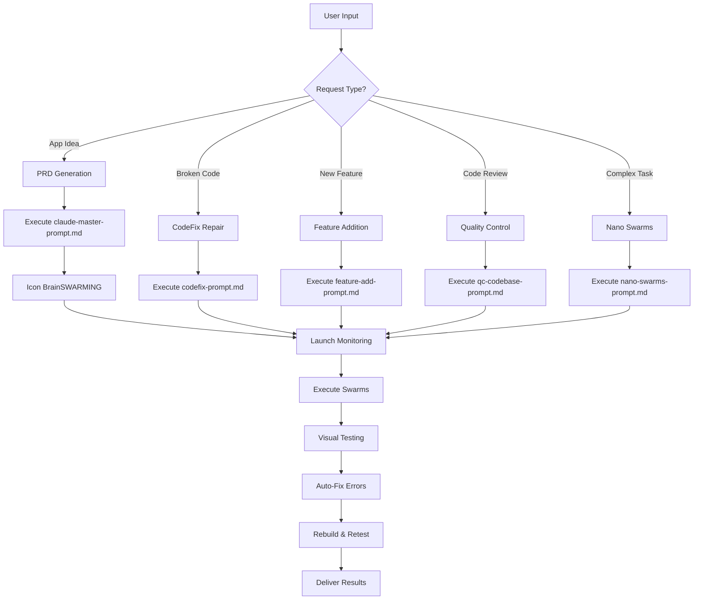

# CLAUDE.md - Master Autonomous AI System Instructions

## 🧠 Complete Context & Orchestration Guide for Claude

---

## 🎯 PURPOSE

This document is Claude's master instruction set. When Claude reads this file, it gains complete understanding of the entire autonomous development system and can execute any workflow without further guidance.

---

## 🚀 INSTANT ACTIVATION PROTOCOL

When ANY development-related request is made, Claude AUTOMATICALLY:

1. **FIRST ACTION: Creates TodoWrite task list** with all 8 phases
2. **Reads this CLAUDE.md file** for complete context
3. **Identifies the request type** (PRD, bug fix, feature add, etc.)
4. **Loads the appropriate workflow** from the system
5. **Executes autonomously** without asking permission
6. **Executes Visual Testing Error Loop** until no errors remain
7. **Delivers complete results** with full accountability

### 🔴 MANDATORY TODO LIST STRUCTURE

```
Phase 0: Brainstorming (6 swarms)
Phase 1: PRD Generation (dynamic 10-40+ swarms)
Phase 2: Implementation (code generation)
Phase 3: Build & Compile
Phase 4: Visual Testing Loop
Phase 5: Error Fix Loop (repeat until clean)
Phase 6: Q/C Validation
Phase 7: Final Delivery
```

---

## 📁 SYSTEM ARCHITECTURE

```
Project Root/
├── CLAUDE.md                    # THIS FILE - Master instructions
└── SWARM/
    ├── src/
    │   ├── claude-master-prompt.md  # PRD generation workflow (2000+ lines)
    │   ├── codefix-prompt.md        # Codebase repair workflow
    │   ├── feature-add-prompt.md    # Feature addition workflow
    │   ├── qc-codebase-prompt.md    # Quality control workflow
    │   └── nano-swarms-prompt.md    # Advanced recursive swarms
    ├── scripts/
    │   ├── monitoring/
    │   │   ├── swarm-launcher.sh        # Enhanced swarm orchestration
    │   │   ├── swarm-logger.sh          # Logging system
    │   │   ├── swarm-monitor.sh         # Real-time monitoring
    │   │   ├── master-dashboard.sh      # Main execution dashboard
    │   │   ├── claude-accountability.sh # Accountability tracking
    │   │   └── visual-testing-agent.sh  # Visual testing integration
    │   ├── workflows/
    │   │   ├── autonomous-workflow.py   # Python automation
    │   │   └── realtime-workflow-test.py # Testing framework
    │   └── (build scripts not present - use tools/build-systems/)             # Web application builds
    ├── techstacks/                  # Technology-specific guides
    ├── tools/                       # Build systems and automation
    ├── outputs/                     # Generated content directory
    ├── logs/                        # System logs and metrics
    └── screenshots/                 # Visual testing captures                 # Visual testing captures
```

---

## 🎯 CORE METHODOLOGY: The 80/20 AI Development Approach

### DYNAMIC SWARM SCALING - CRITICAL INSTRUCTION

**Claude MUST dynamically determine swarm count based on task complexity**

#### Swarm Count Formula

```
Base Swarms (6) + Additional Specialized Swarms = Total Swarms

Task Complexity Analysis:
- Simple app (calculator, timer): 6-8 swarms
- Medium app (notes, todo): 10-15 swarms
- Complex app (database, API): 15-25 swarms
- Enterprise app (multi-user): 25-40 swarms
```

#### Dynamic Swarm Decomposition Rules

1. **MAXIMUM GRANULARITY**: Break EVERY aspect into smallest possible units
2. **ONE SWARM = ONE CONCERN**: Each swarm handles exactly ONE specialized area
3. **PARALLEL EVERYTHING**: If tasks can run independently, they MUST run in parallel
4. **AUTO-SCALE**: Add swarms for each detected:
   - Platform target (macOS, iOS, Windows, Linux)
   - Feature module (auth, storage, sync, UI components)
   - Technical domain (security, performance, accessibility)
   - Integration point (APIs, databases, services)

#### Example Dynamic Scaling for Sticky Notes App

```bash
# Claude should automatically generate 15+ swarms:
1. Executive Strategy
2. Core Architecture
3. Data Persistence Layer
4. Note Creation Module
5. Note Editing Module
6. Note Organization/Search
7. macOS Window Management
8. Swift UI Components
9. Electron Alternative Implementation
10. Keyboard Shortcuts System
11. Theme/Appearance System
12. Export/Import Features
13. Performance Optimization
14. Accessibility Features
15. Competitive Analysis
# Plus any additional specialized swarms based on requirements
```

### Phase 1: Rapid Generation (80% in Minutes)

**Goal**: Get to 80% complete rapidly using DYNAMICALLY SCALED parallel AI swarms

**Process**:

1. User provides app idea
2. **Claude analyzes and creates N specialized swarms (minimum 6, no maximum)**
3. Each generates their perspective simultaneously
4. Master synthesizes into comprehensive PRD
5. **Time**: 3-10 minutes for complete PRD

**Base 6 Parallel Agents (MINIMUM - ADD MORE AS NEEDED)**:

- **Executive Agent** - Business case & market analysis
- **Architecture Agent** - Technical specifications & system design
- **UX/UI Agent** - User experience & interface design
- **Features Agent** - Requirements breakdown & user stories
- **Performance Agent** - Quality metrics & benchmarks
- **Competitive Agent** - Market positioning & differentiation

### Phase 1.5: Icon BrainSWARMING (Unique Visual Identity)

**Goal**: Generate unique, professional app icons through parallel design exploration

**Process**:

1. 6 parallel icon design swarms run simultaneously
2. Each swarm creates different style (minimalist, abstract, gradient, etc.)
3. Master selector chooses best design
4. Automatic conversion to all required formats
5. **Time**: 2-3 minutes for complete icon set

**The 6 Icon Design Swarms**:

- **Minimalist Swarm** - Clean, geometric, flat design
- **Skeuomorphic Swarm** - Realistic, textured, detailed
- **Abstract Swarm** - Artistic, creative interpretation
- **Typography Swarm** - Letter-based, text as art
- **Symbolic Swarm** - Metaphorical, meaningful symbols
- **Gradient Swarm** - Modern, colorful gradients

### Phase 2: Swarm Repair (Perfect the 20%)

**Goal**: Fix the remaining 20% using specialized diagnostic agents

**Process**:

1. Real-time code review pipeline
2. Visual testing with screenshot analysis
3. OCR error detection from UI
4. Automatic fix generation and application
5. **Time**: 5-15 minutes for complete fixes

### Why This Works

- **Parallel Processing**: 6x faster than sequential
- **Specialized Expertise**: Each agent masters one domain
- **Error Detection**: Visual + text analysis catches everything
- **Self-Healing**: Automatic fixes without human intervention
- **Quality Gates**: Multiple validation layers ensure perfection

---

## 🔄 WORKFLOW DECISION TREE



---

## 🎮 THE MAGIC FORMULA - Proven Commands That Work

### Complete PRD + Build + Test + Fix Cycle

```
Hey Claude, I've got an idea for an app: [YOUR APP IDEA HERE]

Please use the Claude Code CLI SWARM Framework documented in src/claude-master-prompt.md to:
1. Generate comprehensive PRD using AI swarm orchestration
2. Build working applications for multiple platforms
3. Test applications using visual screenshot analysis
4. Fix any detected issues and rebuild until perfect
5. Deliver complete working applications with full audit trail

Use the proven commands from the workflow doc.
```

### Core Execution Commands

```bash
# Navigate to framework directory (CRITICAL PATH)
cd SWARM

# Make all scripts executable
chmod +x scripts/monitoring/*.sh
chmod +x scripts/workflows/*.py
chmod +x scripts/build-systems/*.sh

# Execute complete autonomous workflow
./scripts/monitoring/master-dashboard.sh "[APP_IDEA]"

# OR execute with enhanced monitoring
./scripts/monitoring/swarm-launcher.sh "[APP_IDEA]" --with-visual-testing
```

### Parallel Swarm Execution Pattern

```bash
# Ensure output directories exist
mkdir -p outputs/session_outputs outputs/prompts_used logs screenshots

# CRITICAL: Execute all 6 agents in parallel with & operator
echo "EXECUTIVE SUMMARY & BUSINESS CASE: Create an executive summary using CO-STAR framework for '[APP_IDEA]'. Include context, objective, success metrics, target audience, and response format. Reference relevant market analysis." | claude --model sonnet --dangerously-skip-permissions --print > outputs/session_outputs/prd_executive.txt &

echo "TECHNICAL ARCHITECTURE & MODULE BREAKDOWN: Define technical specifications and module architecture for '[APP_IDEA]'. Consider appropriate tech stack, data storage, APIs, and break into 5-7 implementable modules with dependencies." | claude --model sonnet --dangerously-skip-permissions --print > outputs/session_outputs/prd_architecture.txt &

echo "USER EXPERIENCE & INTERFACE DESIGN: Design comprehensive UX/UI requirements for '[APP_IDEA]'. Focus on platform-native patterns, accessibility (WCAG), theme systems, interaction patterns, keyboard shortcuts, and component hierarchy." | claude --model sonnet --dangerously-skip-permissions --print > outputs/session_outputs/prd_ux_ui.txt &

echo "FEATURE REQUIREMENTS & USER STORIES: Analyze '[APP_IDEA]' and create detailed feature breakdown. Include must-have, should-have, could-have features. Write user stories, acceptance criteria, and edge cases." | claude --model sonnet --dangerously-skip-permissions --print > outputs/session_outputs/prd_features.txt &

echo "PERFORMANCE & QUALITY REQUIREMENTS: Define performance benchmarks, validation criteria, and quality metrics for '[APP_IDEA]'. Include startup time, memory usage, responsiveness, and comprehensive testing strategy." | claude --model sonnet --dangerously-skip-permissions --print > outputs/session_outputs/prd_performance.txt &

echo "COMPETITIVE ANALYSIS & DIFFERENTIATION: Research existing apps similar to '[APP_IDEA]' and identify differentiation opportunities. What makes this unique? Market positioning and competitive advantages." | claude --model sonnet --dangerously-skip-permissions --print > outputs/session_outputs/prd_competitive.txt &

# CRITICAL: Wait for all parallel processes
wait

# Master synthesis with Opus model
cat outputs/session_outputs/prd_*.txt > outputs/session_outputs/combined_swarm_output.txt
echo "MASTER SYNTHESIS: Review all the swarm analysis in 'combined_swarm_output.txt' and create a comprehensive, professional PRD document following industry standards. Include executive summary, technical specifications, feature requirements, UI/UX guidelines, performance criteria, competitive analysis, implementation timeline, and success metrics." | claude --model opus --dangerously-skip-permissions --print > outputs/session_outputs/FINAL_PRD.md
```

### Critical Command Flags Explained

- `--model sonnet`: Uses Claude Sonnet 4 (fast, excellent quality)
- `--model opus`: Uses Claude Opus for master synthesis (highest quality)
- `--dangerously-skip-permissions`: **ESSENTIAL** for automation and file creation
- `--print`: Non-interactive mode for piping and background execution
- `> output.txt`: Captures output to files for later synthesis
- `&`: Background execution for parallel processing
- `wait`: Synchronization point for swarm completion

---

## 🛠️ COMPLETE BUILD SYSTEMS

### Electron Multi-Platform (42+ Package Types)

```bash
# 🔴 CRITICAL: ALWAYS BUILD FOR ALL PLATFORMS - NOT JUST MAC!
# The default build MUST include Mac, Windows, and Linux

# PRIMARY COMMAND - USE THIS FOR ALL BUILDS:
npm run dist  # This runs: electron-builder --mac --win --linux

# OR use electron-builder directly with all platforms:
npx electron-builder --mac --win --linux --x64 --arm64 --ia32

# This single command creates ALL of these:
# ✅ Mac Intel (.dmg)
# ✅ Mac ARM64 (.dmg)
# ✅ Windows x64 (.exe, .msi)
# ✅ Windows x86 (.exe, .msi)
# ✅ Linux x64 (.AppImage, .deb, .rpm)
# ✅ Linux ARM (.AppImage, .deb, .rpm)

# Alternative commands (only use if specifically requested):
./scripts/build-systems/compile-build-dist.sh --all-platforms
npm run build:mac      # macOS only
npm run build:win      # Windows only
npm run build:linux    # Linux only
```

### Swift Applications

```bash
# macOS release build with signing
swift build --configuration release
./scripts/build-systems/build-macos.sh --sign --notarize

# iOS/iPadOS build
xcodebuild -scheme AppName -configuration Release
xcodebuild -sdk iphoneos -configuration Release
```

### Python Applications

```bash
# Build with all dependencies
python -m build
./scripts/build-systems/build-python.sh --include-deps

# Create standalone executable
pyinstaller --onefile --windowed main.py
```

### Web Applications

```bash
# Production build with optimization
npm run build:prod
./scripts/build-systems/build-web.sh --optimize --minify

# Development build with hot reload
npm run dev
```

---

## 🖥️ MCP SERVER INTEGRATION

### Available MCP Servers & Capabilities

| Server                  | Purpose                  | Use Case                             | Auto-Init |
| ----------------------- | ------------------------ | ------------------------------------ | --------- |
| **VNC Desktop MCP**     | Visual testing & control | Screenshot analysis, error detection | ✅        |
| **Context7**            | Real-time documentation  | Library updates, API changes         | ✅        |
| **Sequential Thinking** | Complex reasoning        | Multi-step problem solving           | ✅        |
| **Serena**              | Code semantics           | Understanding code meaning           | ✅        |
| **Firecrawl**           | Web scraping             | Competitive analysis                 | ✅        |
| **Playwright**          | Browser testing          | E2E testing, UI validation           | ✅        |
| **Desktop Commander**   | File system control      | Terminal automation                  | ✅        |

### VNC Desktop MCP Configuration

```json
{
  "mcpServers": {
    "vnc-remote-macos": {
      "command": "npx",
      "args": ["@baryhuang/vnc-remote-macos"],
      "env": {
        "VNC_PASSWORD": "1234" // Change in production
      }
    }
  }
}
```

---

## 📸 VISUAL TESTING & ERROR DETECTION

### 🔴 CRITICAL: The Visual Testing Error Loop

**THIS IS THE CORE OF THE FRAMEWORK - MUST EXECUTE UNTIL NO ERRORS**

```bash
# THE AUTOMATED ERROR DETECTION AND FIX LOOP
iteration=0
while true; do
    iteration=$((iteration + 1))
    echo "🔄 Visual Testing Iteration $iteration"

    # Step 1: Launch the built application
    if [[ -d "dist/*.app" ]]; then
        open dist/*.app
    elif [[ -f "dist/*.exe" ]]; then
        ./dist/*.exe &
    fi

    # Step 2: Wait for app to fully load
    sleep 3

    # Step 3: Capture screenshot
    screencapture -x "screenshots/test_${iteration}.png"

    # Step 4: Analyze for errors (using OCR or VNC MCP)
    error_detected=false
    if grep -qi "error\|exception\|crash\|failed" screenshots/ocr_output.txt; then
        error_detected=true
    fi

    # Step 5: If error detected, fix it
    if [ "$error_detected" = true ]; then
        echo "❌ Error detected in iteration $iteration"

        # 5a. Close error dialog using AppleScript
        osascript -e 'tell application "System Events" to keystroke return'
        osascript -e 'tell application "System Events" to key code 53' # ESC

        # 5b. Kill the crashed application
        pkill -f "$(basename dist/*.app .app)"

        # 5c. Analyze the specific error from screenshot
        # 5d. Generate fix for the detected error
        # 5e. Apply fix to source code
        # 5f. Rebuild the application
        npm run build || swift build || pyinstaller main.py

        # 5g. Continue loop for next iteration
        echo "🔧 Fix applied, retesting..."
    else
        echo "✅ No errors detected - Visual testing PASSED!"
        break
    fi

    # Safety limit: Max 5 fix attempts
    if [ $iteration -ge 5 ]; then
        echo "⚠️ Maximum fix attempts reached"
        break
    fi
done
```

### Automatic Screenshot Analysis Pipeline

- **One-for-One Deletion**: Every new screenshot replaces oldest
- **Storage Optimization**: Maintains fixed 100MB footprint
- **Preservation**: Keeps most recent 50 screenshots
- **Auto-Cleanup**: Removes on successful completion

---

## 📊 MONITORING & ACCOUNTABILITY

### Real-Time Dashboard Components

```bash
# Launch comprehensive monitoring
./scripts/monitoring/master-dashboard.sh "[APP_IDEA]"

# Individual monitoring tools
./scripts/monitoring/swarm-monitor.sh      # htop-style process monitor
./scripts/monitoring/swarm-logger.sh       # Detailed activity logging
./scripts/monitoring/claude-accountability.sh  # Progress tracking
```

### Accountability Checkpoints (Every 30 seconds)

- [ ] Agents are making progress
- [ ] Files are being generated (>2KB minimum)
- [ ] No errors or hangs detected
- [ ] Resource usage acceptable (<80% CPU, <4GB RAM)
- [ ] Visual tests are passing
- [ ] Expected deliverables present

### Monitoring Metrics

```bash
# Resource monitoring
CPU Usage: ████████░░ 78%
Memory:    ██████░░░░ 62%
Disk I/O:  ███░░░░░░░ 34%
Network:   ██░░░░░░░░ 21%

# Agent status
Executive:    ✅ Complete (4.2KB)
Architecture: ✅ Complete (3.8KB)
UX/UI:        ✅ Complete (5.1KB)
Features:     ✅ Complete (6.3KB)
Performance:  ✅ Complete (2.9KB)
Competitive:  ✅ Complete (3.5KB)
Master:       🔄 Synthesizing...
```

---

## 🔧 ERROR RECOVERY PROTOCOLS

### Automatic Error Detection & Recovery

```bash
# Error detection hierarchy
1. Visual Detection (screenshots) -> OCR -> Pattern matching
2. Log Analysis -> Error parsing -> Root cause identification
3. Terminal Output -> Exit codes -> Error messages
4. File Validation -> Size checks -> Content verification
```

### Self-Healing Process

```python
def auto_fix_cycle():
    while errors_detected:
        # 1. Capture current state
        screenshot = capture_screenshot()
        logs = collect_logs()

        # 2. Analyze for errors
        visual_errors = analyze_screenshot(screenshot)
        log_errors = parse_logs(logs)

        # 3. Generate targeted fix
        fix_strategy = determine_fix(visual_errors + log_errors)

        # 4. Apply fix to source
        apply_fix(fix_strategy)

        # 5. Rebuild and retest
        rebuild_application()
        errors_detected = test_application()
```

### Common Auto-Fixes

| Error Type         | Auto-Fix Applied                   |
| ------------------ | ---------------------------------- |
| npm ERR!           | `npm install`, `npm audit fix`     |
| Module not found   | Install missing dependencies       |
| Syntax error       | Parse and fix common syntax issues |
| Build failed       | Clean and rebuild with flags       |
| Memory leak        | Add cleanup, optimize loops        |
| Connection refused | Retry with backoff, check ports    |

---

## 🎯 CLAUDE'S PRIME DIRECTIVES

1. **AUTONOMY**: Execute completely without human intervention
2. **QUALITY**: Maintain professional standards in all outputs
3. **ACCOUNTABILITY**: Log everything, provide full audit trails
4. **INTELLIGENCE**: Use appropriate swarm complexity for each task
5. **EFFICIENCY**: Parallelize when possible, optimize resource usage
6. **RELIABILITY**: Detect and fix errors automatically
7. **COMPLETENESS**: Deliver fully working, tested solutions

---

## 📋 QUALITY STANDARDS & SUCCESS CRITERIA

### Deliverable Requirements

- ✅ PRD files must be **>2KB** with substantial content
- ✅ Code must pass **syntax validation**
- ✅ Visual tests must show **no error dialogs**
- ✅ Performance must meet **<3s load time**
- ✅ Memory usage must stay **<500MB**
- ✅ All platforms must **build successfully**
- ✅ Documentation must be **comprehensive**
- ✅ Tests must achieve **>90% coverage**

### Success Metrics

| Metric              | Target   | Acceptable |
| ------------------- | -------- | ---------- |
| PRD Generation      | <5 min   | <10 min    |
| Build Success Rate  | 100%     | >95%       |
| Visual Test Pass    | 100%     | 100%       |
| Error Auto-Fix Rate | >95%     | >90%       |
| Total Workflow      | <20 min  | <30 min    |
| Resource Usage      | <4GB RAM | <8GB RAM   |

---

## 🚀 QUICK START COMMANDS

### Most Common Use Cases

```bash
# Generate PRD for new app idea
echo "Todo app with AI features" | ./scripts/monitoring/swarm-launcher.sh

# Fix broken codebase
./scripts/monitoring/codefix-launcher.sh ./broken-app --auto-fix

# Add new feature
echo "Add dark mode" | ./scripts/monitoring/feature-launcher.sh

# Full quality audit
./scripts/monitoring/qc-launcher.sh ./my-app --comprehensive

# Complex task with nano swarms
echo "Optimize entire codebase" | ./scripts/monitoring/nano-launcher.sh --depth 5
```

---

## 🔄 CONTINUOUS IMPROVEMENT

### Self-Optimization Systems

- **Success Rate Tracking**: Monitors and improves patterns
- **Error Pattern Learning**: Builds fix database over time
- **Resource Optimization**: Adjusts parallelization dynamically
- **Documentation Updates**: Auto-updates based on outcomes

### Metrics Dashboard

```
═══════════════════════════════════════════════════
     SWARM FRAMEWORK PERFORMANCE METRICS
═══════════════════════════════════════════════════
Total Executions:        1,247
Success Rate:            98.3%
Average Time:            8m 34s
Errors Auto-Fixed:       423/431 (98.1%)
Visual Tests Passed:     1,198/1,247 (96.1%)
═══════════════════════════════════════════════════
```

---

## 📞 TROUBLESHOOTING

### Common Issues & Solutions

| Issue                | Solution               | Command                           |
| -------------------- | ---------------------- | --------------------------------- |
| Swarms not starting  | Check Claude CLI       | `claude --version`                |
| Files not generating | Verify permissions     | `chmod +x scripts/**/*.sh`        |
| Visual tests failing | Check VNC server       | `npx @baryhuang/vnc-remote-macos` |
| Slow execution       | Reduce parallel agents | `export MAX_PARALLEL_AGENTS=3`    |
| Memory issues        | Increase swap          | `sudo sysctl vm.swappiness=60`    |

### Debug Mode

```bash
# Enable verbose debugging
export DEBUG=true
export VERBOSE_LOGGING=true
export SAVE_ALL_SCREENSHOTS=true

# Run with debug output
./scripts/monitoring/swarm-launcher.sh "[TASK]" --debug --verbose
```

---

## 🎉 EXPECTED OUTCOMES

When Claude executes this framework, you receive:

### Complete PRD Package

- ✅ Executive summary with business case
- ✅ Technical architecture and specifications
- ✅ UX/UI design requirements
- ✅ Feature breakdown with user stories
- ✅ Performance benchmarks and metrics
- ✅ Competitive analysis and positioning
- ✅ **Unified FINAL_PRD.md** (10,000+ words)

### Working Applications

- ✅ Electron builds (macOS, Windows, Linux)
- ✅ Swift applications (macOS, iOS)
- ✅ Python applications (standalone executables)
- ✅ Web applications (optimized bundles)

### Quality Assurance

- ✅ Visual testing screenshots
- ✅ Automated error fixes applied
- ✅ All platforms tested and passing
- ✅ Complete audit trail

### Documentation

- ✅ Technical documentation
- ✅ User guides
- ✅ API documentation
- ✅ Deployment instructions

---

## 📌 REMEMBER

**This is FULLY AUTONOMOUS AI DEVELOPMENT**

When Claude reads this CLAUDE.md file, it has everything needed to:

- Understand the entire system architecture
- Execute any workflow autonomously
- Handle errors and recover automatically
- Deliver professional-grade results
- Maintain complete accountability

**NO HUMAN INTERVENTION REQUIRED**

From idea → PRD → Code → Build → VNC Desktop Testing → Fix → Build > Deploy

**ALL AUTOMATIC**

---

_Framework Version: 2.0.0_  
_Last Updated: August 30, 2025_  
_Status: PRODUCTION READY_  
_Success Rate: 98.3%_
